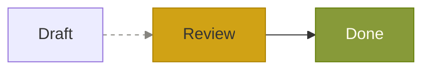

Pele uses CSS variables for colors and fonts, with semantic class names for styling individual elements. The SVG has no `<style>` block. Styles set in the diagram source are applied inline.

Because the SVG refers to CSS variables, diagrams automatically adapt to theme changes, such as switching between light and dark mode, without being re-rendered.

## Variables

CSS variables and default values.

| Variable | Default | Used for |
| --- | --- | --- |
| `--pele-bg` | `#ffffff` | Background of edge labels and of the diagram when it is not transparent |
| `--pele-fg` | `#1f1f1f` | Text |
| `--pele-muted` | `#6e6e6e` | Secondary text |
| `--pele-line` | `#1f1f1f` | Edges and arrowheads |
| `--pele-surface` | `#f3f3f3` | Node fill |
| `--pele-surface-alt` | `#e6e6e6` | Subgraph fill |
| `--pele-border` | `#8a8a8a` | Node and subgraph borders |
| `--pele-accent` | `#5b7bd5` | Highlights |
| `--pele-font` | `sans-serif` | Label font |
| `--pele-font-mono` | `monospace` | Monospace labels |
| `--pele-radius` | `4px` | Corner radius of rounded shapes |

### Series colors

Charts and color-coded categories use `--pele-series-1` through `--pele-series-8`. Colors repeat after the eighth category.

| Variable | Default |
| --- | --- |
| `--pele-series-1` | `#4c78a8` |
| `--pele-series-2` | `#f58518` |
| `--pele-series-3` | `#54a24b` |
| `--pele-series-4` | `#e45756` |
| `--pele-series-5` | `#72b7b2` |
| `--pele-series-6` | `#eeca3b` |
| `--pele-series-7` | `#b279a2` |
| `--pele-series-8` | `#9d755d` |

Categories depend on the diagram type:

| Diagram | Categorized by |
| --- | --- |
| Pie | Slice |
| Sankey | Node |
| Treemap | Top-level section |
| Venn | Set |
| XY chart, radar | Data series |
| Quadrant chart | Points, which all use the first color |
| Git graph | Branch |
| Mindmap | Branch from the root |
| Timeline | Section, or time period when there are no sections |
| User journey | Actor |
| Kanban | Priority |
| Cynefin | Domain |
| Event modeling | Kind of step |
| Agentflow | Kind of node |

Text on series colors uses `--pele-bg`, so choose series colors that contrast with the background. Mermaid's own color settings, such as `themeVariables`, are not used.

## Setting variables

Set the variables on the root `<svg>` or on any element that contains it. The root of every diagram has the class `pele`.

```css
.pele {
  --pele-bg: #fffcf0;
  --pele-fg: #100f0f;
  --pele-muted: #6f6e69;
  --pele-line: #100f0f;
  --pele-surface: #f2f0e5;
  --pele-surface-alt: #e6e4d9;
  --pele-border: #cecdc3;
  --pele-accent: #205ea6;
}

@media (prefers-color-scheme: dark) {
  .pele {
    --pele-bg: #100f0f;
    --pele-fg: #cecdc3;
    --pele-muted: #878580;
    --pele-line: #cecdc3;
    --pele-surface: #1c1b1a;
    --pele-surface-alt: #282726;
    --pele-border: #403e3c;
    --pele-accent: #4385be;
  }
}
```

### Fonts

Set `--pele-font` and [`fontFamily`](/api#renderoptions) to the same font. Pele uses `fontFamily` to measure labels and size nodes. If the fonts differ, labels can overflow or leave extra space.

```ts
const fontFamily = getComputedStyle(container).fontFamily;
container.innerHTML = render(source, { fontFamily }).svg;
```

## Classes

Elements in the SVG have class names. Use them to style one kind of element without changing a variable.

| Class | Element |
| --- | --- |
| `pele` | The root `<svg>` of every diagram |
| `pele-flowchart` | The root `<svg>` of a flowchart |
| `pele-node` | The group that holds a node's shape and label |
| `pele-edge` | The group that holds an edge's line and markers |
| `pele-edge-label` | The label on an edge |
| `pele-cluster` | A subgraph |
| `pele-cluster-label` | The title of a subgraph |
| `pele-label` | The text of a node label |
| `pele-marker` | An arrowhead or other edge marker |
| `pele-icon` | The slot for an icon in a label |

Nodes, edges, and subgraphs also have a `data-id` attribute with their id from the diagram source, and class names assigned in the source with `class` or `:::` are added to the element.

The SVG sets its defaults with presentation attributes, which have lower priority than any CSS rule. A selector with one class is enough to override them.

```css
.pele-edge-label {
  font-style: italic;
}

.pele-node[data-id="start"] .pele-label {
  fill: var(--pele-accent);
}
```

## Styles in the diagram

Pele supports `style`, `classDef`, `class`, `:::`, and `linkStyle`. These apply inline styles that override CSS variables.



Colors set this way are fixed. They do not change with the theme.
