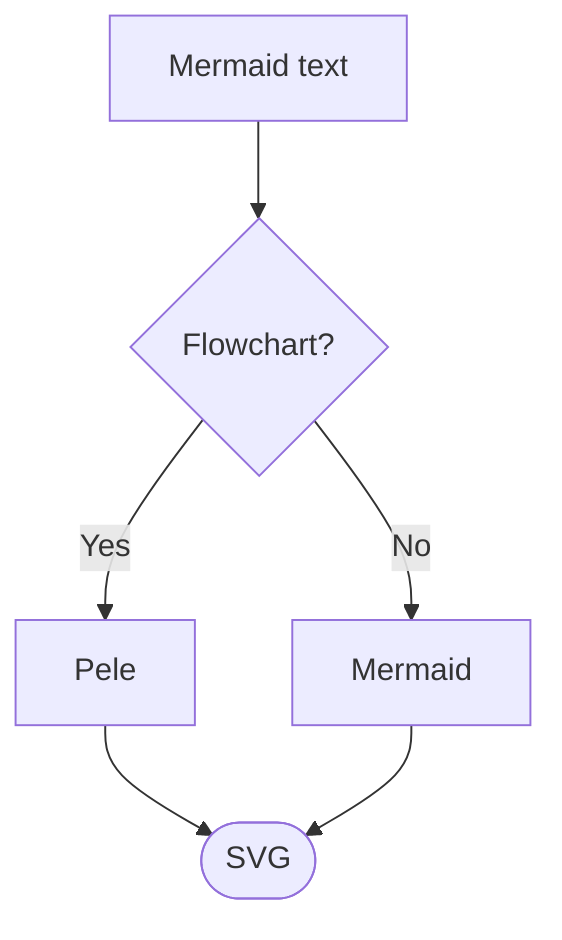

# Pele

Pele is a lightweight library that renders [Mermaid](https://mermaid.js.org) diagrams to SVG, [themed with CSS variables](/theming).

## How it works

Pass Mermaid syntax, Pele returns an SVG.

### Mermaid



Use CSS variables to set colors and fonts. Diagrams automatically adapt to theme changes without being re-rendered.

### CSS

```css
.pele {
  --pele-bg: #fffcf0;
  --pele-fg: #100f0f;
  --pele-muted: #6f6e69;
  --pele-line: #100f0f;
  --pele-surface: #f2f0e5;
  --pele-surface-alt: #e6e4d9;
  --pele-border: #cecdc3;
}
```

## Pele in your app

Add Pele to your app using the [API](/api).

```shell
npm install pele
```

Pass Mermaid syntax to `render()` and insert the returned SVG into your page.

```ts
import { render } from 'pele';

const { svg } = render(`flowchart LR
  A[Mermaid text] --> B[SVG]`);

document.querySelector('#diagram').innerHTML = svg;
```

## Explore

### [Examples](/examples)

Browse supported diagram types.

### [API](/api)

Render diagrams in your app.

### [Theming](/theming)

Set colors and fonts with CSS variables.

### [Compatibility](/compatibility)

Compare syntax, layout, and features with Mermaid.

## Pele in use

Pele is [open source](https://github.com/obsidianmd/pele), developed for [Obsidian](https://obsidian.md) to render diagrams quickly and match your theme. It is named after [Pele](https://en.wikipedia.org/wiki/Pele_(deity)), the goddess of volcanoes and fire.
